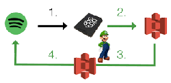

<h1 align="center">
  <picture>
    <source media="(prefers-color-scheme: dark)" srcset="luigi.png"/>
    <source media="(prefers-color-scheme: light)" srcset="luigi.png"/>
    
 <br />
</h1>


# Luigi ML Pipeline

This repository showcases an easy-to-follow method for automating data transformations, modeling, and a [Luigi](https://github.com/spotify/luigi) data pipeline.


#### Key Components

- Python version 3.7 or higher
- Streamlit for interactive applications
- Scikit-learn for machine learning tasks
- Pandas for data handling
- Luigi for workflow automation


## Concept

The entire workflow is encapsulated in an interactive application found in the `pipeline.py` script. Refer to the instructions in the "How to Run the Scripts" section for details on setting up and launching the application.

## Configuration

1. Set up a dedicated virtual environment (using `conda` is suggested):
   ```bash
   conda create --name data_workflow python=3.7
   ```
2. Activate your new virtual environment:
   ```bash
   conda activate data_workflow
   ```
3. Install the necessary packages:
   ```bash
   pip install -r requirements.txt
   ```


## Running the Scripts

#### Interactive Application

To launch the interactive app, use the Streamlit command within your activated virtual environment:
```bash
(data_workflow) streamlit run pipeline.py
```

This will start a local server accessible at: [`http://localhost:8501`](http://localhost:8501).

#### Data Workflow

To run a specific task, for instance `TaskX` located in the `workflow.py` script, use the following command:

```bash
PYTHONPATH=. luigi --module workflow TaskX --local-scheduler
```

Feel free to expand upon the code by adding your own custom tasks!

